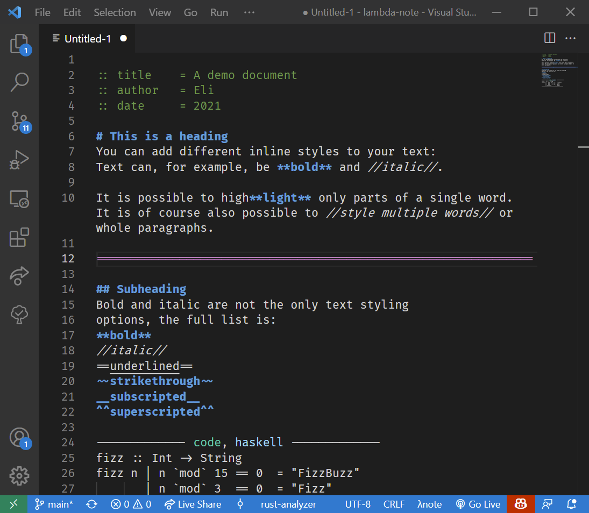

<p align="center">
    <br/>
    A simple, <strong>highly extendable</strong>, markup language
    inspired by markdown and org mode.
    <br/>
    <br/>
</p>

# Syntax and usage

**Text and paragraphs**
```
This is a paragraph of just plain text.

This is another paragraph because there 
is a blank line between them.
```

**Styling text**

You can add different inline styles to your text:
```
Text can, for example, be **bold** and //italic//.

It is possible to high**light** only parts of a single word. It is of course 
also possible to //style multiple words// or whole paragraphs.

Bold and italic are not the only text styling
options, the full list is:
**bold**
//italic//
==underlined==
~~strikethrough~~
__subscripted__
^^superscripted^^
```

**Headings**

Headings works the same way as in markdown. 
```
# A big heading
## A subheading
### Another, even smaller, subheading
```

**Thematic breaks**

Thematic breaks (rendered as a vertical line or a page break) are
produced by starting a line with **three** or more equals signs, for example:
```
some content

====================

a different sections
```

**Metadata**

To provide additonal information about the document 
you can add metadata fields: 
```
:: author = Eli Adelhult
:: date   = 2021
```

**Extensions**

The most powerful feature of λnote is its **extension system**. You might find yourself 
wanting to do more complicated things than just styling text and adding headings. It
might for instance be useful to typeset math, include code (with pretty syntax highlighting) or
add images to your documents. Here a few examples of block and inline extensions expressions.


**Block example**

Here is an example were we use a built-in extension called `code`
```
-------- code ----------------
def hello(name):
    print(f"hello {name}!")
------------------------------
```

Note: only three lines to open and close the block are required.
```
--- code
def hello(name):
    print(f"hello {name}!")
---
```


**Extensions can take multiple arguments**
```
-------- code, python --------
def hello(name):
    print(f"hello {name}!")
------------------------------
```

**Inline extensions**

Extensions can also be used inside of a paragraph
```
This famous equation |math, E = mc^2| was written by Einstein.

|img, ada.jpg, An image of a Ada Lovelace|
```

# Installation
Since the project is very much a work in progress no precompiled binary is available at the moment. Hovewer, you can build the simple cli tool **lambda** yourself if you want to
```
cd lambda_cli
cargo run <input file> <output file>
```

**Live preview:** if you omit the output file the cli will start a live preview of your document. For that to work you need to have node and live-server installed.
```
npm install -g live-server
```

**Output other formats:** λnote has native support for LaTeX and HTML. If you want to use some other document format, the cli will try to envoke [pandoc](https://pandoc.org/) to convert into that format.

# Syntax highlighting
There is a VS Code extension with λnote support which can be found inside of the `lambda_note_syntax` directory.



